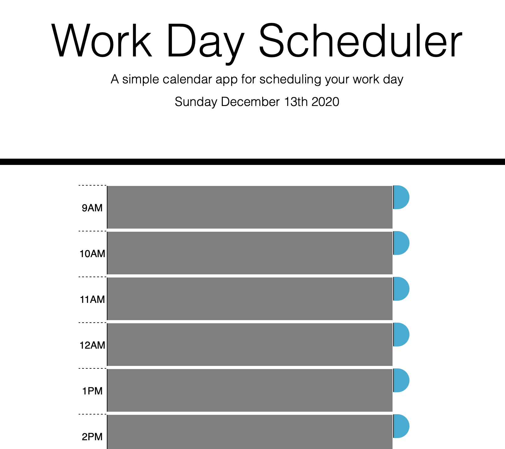

Work_Day_Scheduler

##Table of Contents 
*Purpose of Project 
*Actions Performed 
*Technology Used 
*Summary

##Purpose of Project 
This application allows the user to use the power of JQuery to schedule events daily based upon time.  

##Actions Performed 
Using JQuery & Moment.js, functions were created that allows text to be stored in the table.  When the text is stored in the table, user can save entered data.  Even after refreshing the browser, the data will remain present and visible.  To clear the page, user can choose the "Clear All" button at the bottom of the page.

##Technologies Used 
This website was created with HTML, Javascript/JQuery, Moment.js & CSS.

##Summary 
This app uses the moment.js features to determine the current time and compare it with the future time for a planner.  
<<<<<<< HEAD

GitHub Repo: https://github.com/latuanja/Work_Day_Scheduler
Deployed Site: https://latuanja.github.io/Work_Day_Scheduler/
=======
>>>>>>> a98b43ee2e99c65937c85b393ebcfcc81a8e3708
